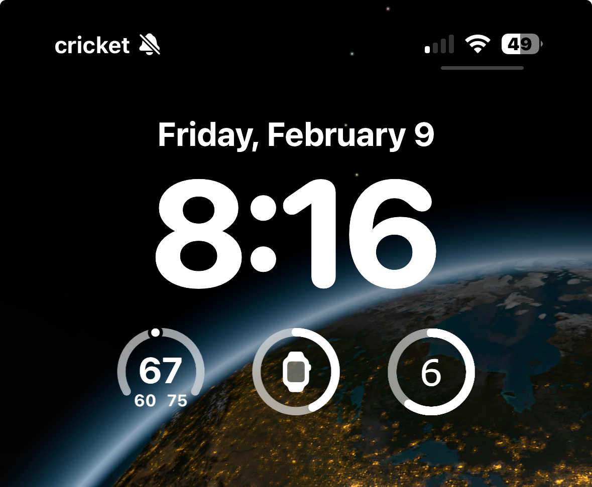
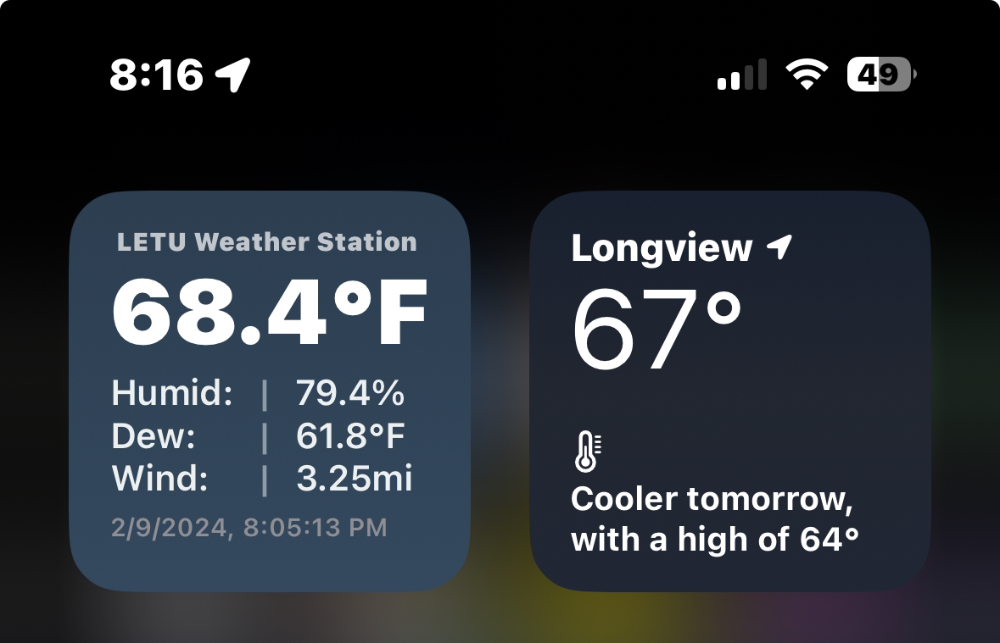

# fennec-weather-widgets
A few IOS Scriptable widgets that make monitoring LETU weather visible and convenient!

    

    

## Installation

1. Make sure you have the Scriptable app installed on your iOS device. You can download it from the App Store.

2. Clone or download the `fennec-weather-widgets` repository to your local machine.

3. Open the Scriptable app on your iOS device.

4. Tap on the "+" button to create a new script.

5. Copy the code from the desired widget .js script file in the `fennec-weather-widgets` repository. (Alternatively, directly import the .scriptable file into the app.)

6. Paste the code into the newly created script in the Scriptable app.

7. Tap on the "Done" button to save the script.

## Adding Widgets to the Lock Screen and Home Screen

1. Go to your iOS device's home screen and enter the 'jiggle mode' by long-pressing on an empty area of the screen or by tapping and holding on an app icon until the icons start to wiggle.

2. Tap on the "+" button in the top-left corner to add a new widget.

3. Scroll down and find the Scriptable app in the widget list. Tap on it.

4. Choose the medium widget size and tap on the "Add Widget" button.

5. Tap on the newly added widget to open the widget configuration screen.

6. Tap on the "Script" field and select the script you created in the previous section.

7. Customize any additional settings for the widget, such as the location or appearance.

8. Tap on the "Done" button to save the widget configuration.

9. Exit the jiggle mode by pressing the home button or swiping up from the bottom of the screen.

- Setup for the lock screen is similar to the home screen. Add the small size Scriptable widget, and select the Lock Screen script.

